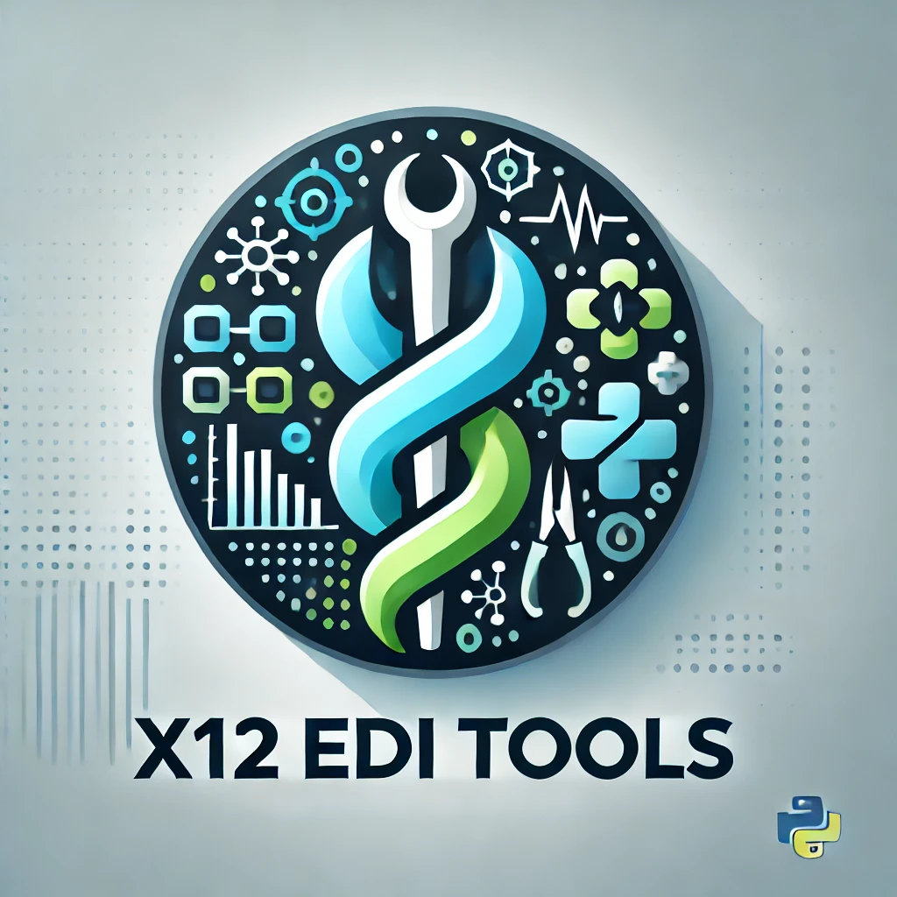

# X12 EDI Tools




A comprehensive Python library for working with X12 EDI (Electronic Data Interchange) files, commonly used in healthcare for claims processing, eligibility verification, and other administrative transactions.

## Installation

Install the X12 EDI Tools library using pip:

```bash
pip install x12-edi-tools
```

## Key Components

### X12Parser
Parses X12 files into Python objects.

```python
from x12_edi_tools import X12Parser

parser = X12Parser()
parsed_data = parser.parse("path/to/x12_file.edi")
print(parsed_data)
```

### X12Generator
Generates X12 files from Python objects.

```python
from x12_edi_tools import X12Generator

generator = X12Generator()
x12_content = generator.generate(data_dict)
with open("output.edi", "w") as f:
    f.write(x12_content)
```

### X12Validator
Validates X12 files against standard formats and custom rules.

```python
from x12_edi_tools import X12Validator

validator = X12Validator()
is_valid, errors = validator.validate("path/to/x12_file.edi")
if not is_valid:
    print("Validation errors:", errors)
```

### DentalClaimProcessor
Processes dental claims (837D transactions).

```python
from x12_edi_tools import DentalClaimProcessor

processor = DentalClaimProcessor()
claims = processor.process("path/to/837D_file.edi")
for claim in claims:
    print(f"Claim ID: {claim.claim_id}, Patient: {claim.patient_name}")
```

### EligibilityChecker
Handles eligibility inquiries and responses (270/271 transactions).

```python
from x12_edi_tools import EligibilityChecker

checker = EligibilityChecker()
request = checker.create_270_request(patient_data)
response = checker.process_271_response(response_data)
print(f"Patient eligible: {response.is_eligible}")
```

### RemittanceAdviceParser
Parses remittance advice (835) transactions.

```python
from x12_edi_tools import RemittanceAdviceParser

parser = RemittanceAdviceParser()
remittance = parser.parse("path/to/835_file.edi")
print(f"Total paid: ${remittance.total_paid}")
```

### X12Converter
Converts X12 data to and from other formats like JSON and CSV.

```python
from x12_edi_tools import X12Converter

converter = X12Converter()
json_data = converter.to_json("path/to/x12_file.edi")
csv_data = converter.to_csv("path/to/x12_file.edi")
```

### X12Encryptor
Encrypts and decrypts X12 data for secure transmission and storage.

```python
from x12_edi_tools import X12Encryptor

encryptor = X12Encryptor("your-secret-key")
encrypted_data = encryptor.encrypt("path/to/x12_file.edi")
decrypted_data = encryptor.decrypt(encrypted_data)
```

### X12DatabaseIntegrator
Facilitates integration of X12 data with databases.

```python
from x12_edi_tools import X12DatabaseIntegrator

integrator = X12DatabaseIntegrator("database_connection_string")
integrator.store_transaction("path/to/x12_file.edi")
transactions = integrator.retrieve_transactions(date_range)
```

### X12Logger
Provides detailed logging of X12 operations for auditing and troubleshooting.

```python
from x12_edi_tools import X12Logger

logger = X12Logger("path/to/log/directory")
logger.log_parse("837", "path/to/837_file.edi", parse_result)
logger.log_generate("835", "path/to/835_file.edi", generation_data)
```

## Contributing

Contributions are welcome! Please feel free to submit a Pull Request.

## Contact

Don Johnson - dj@codetestcode.io

Project Link: [https://github.com/donjohnson/x12-edi-tools](https://github.com/donjohnson/x12-edi-tools)
